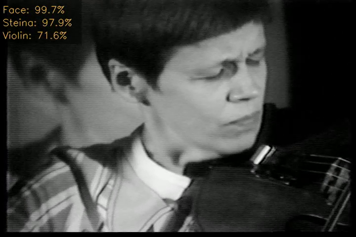

# mediaArtLiveArchive – Video Tagging

[](https://opensource.org/licenses/MIT)

This repository contains a console application used for video content tagging in videos.



## Running the console application
Example 1 – Tagging just one video
```
python video_tagging.py --video_path "path/to/video/video.mp4"
```
Example 2 – Tagging multiple videos in one folder
```
python video_tagging.py --video_path "path/to/videos"
```

## video_tagging.py arguments
|argument|description|type|default|
|---|---|---|---|
|`--video_path`|path to video or folder with videos for tagging|str|"C:/path/to/videos/"|
|`--model_path`|path to trained video model|str|"vasulka-video.h5"|
|`--classes_path`|path to txt file with classes|str|"classes.txt"|
|`--output_path`|output path for predicitions|str|"output/"|
|`--cpu`|if True, tagging runs on CPU|bool|False|
|`--gpu_encode`|if True, video encoding runs on GPU|bool|False|
|`--video_bitrate`|final video bitrate, if 0 bit rate is set to source video height * 4.5|str|0|
|`--show_images`|if true, processed frames will be displayed|bool|False|
|`--save_video`|if True, annotations are rendered to video|bool|False|
|`--plot_predict`|if True, prediction plot is saved to image|bool|False|
|`--skip_videos`|skip selected videos in video_path|str|[]|

## The pre trained model on Vasulka's database can be downloaded here:
* [video_Vasulka.zip](https://vasulkalivearchive.net/models/video_Vasulka.zip) 

### The model allows you to tag these categories:

| **Tag name**             | **F1-score** |
|--------------------------|----------|
| Body                     | 0.865    |
| Digit                    | 0.909    |
| Effect                   | 0.505    |
| Elementair               | 0.712    |
| Elementearth             | 0.661    |
| Elementfire              | 0.704    |
| Elementwater             | 0.676    |
| Face                     | 0.910    |
| Imageprocessingkeying    | 0.593    |
| Interior                 | 0.819    |
| Landscape                | 0.769    |
| Letter                   | 0.923    |
| MachineTVset             | 0.758    |
| Machinecar               | 0.920    |
| Machinevisionfisheye     | 0.894    |
| RuttEtravideosynthesizer | 0.571    |
| Steina                   | 0.340    |
| Violin                   | 0.535    |
| Woody                    | 0.942    |
| Stripes                  | 0.624    |

## Dependencies
```
tensorflow==2.3.1
moviepy==1.0.3
opencv_python==4.3.0.36
matplotlib==3.2.2
numpy==1.18.5
```

### Reference
This repository uses the [Xception] model proposed in:  
Chollet, F. (2017). Xception: Deep learning with depthwise separable convolutions. In Proceedings of the IEEE conference on computer vision and pattern recognition (pp. 1251-1258).

### Cite
Sikora, P. (2022). *MediaArtLiveArchive – Video Tagging* [Software]. https://github.com/vasulkalivearchive/video

### Acknowledgements
The MediaArtLiveArchive – Video Tagging software was implemented with the financial participation of the Technical Agency of the Czech Republic under the ÉTA programme. It is an output of the project Media Art Live Archive: Intelligent Interface for Interactive Mediation of Cultural Heritage (No. TL02000270). 

<!-- [](https://www.tacr.cz/) -->
<a href="https://www.tacr.cz/">
    
</a>